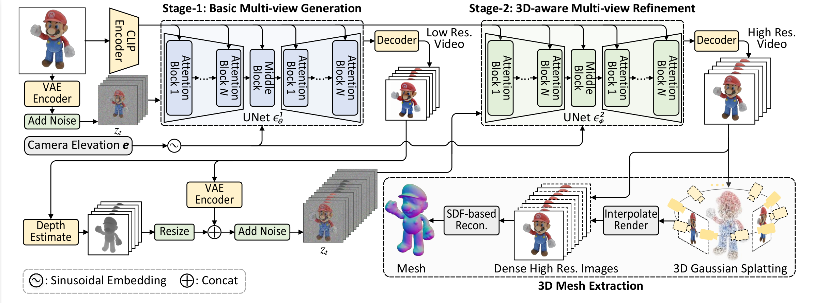

<div align="center">

<!-- TITLE -->
# Hi3D: Pursuing High-Resolution Image-to-3D Generation with Video Diffusion Models



</div>

This is the official implementation of our paper [Hi3D: Pursuing High-Resolution Image-to-3D Generation with Video Diffusion Models](https://arxiv.org/abs/2409.07452) by 
Haibo Yang, Yang Chen, Yingwei Pan, Ting Yao, Zhineng Chen, Chong-Wah Ngo, Tao Mei .

<!-- DESCRIPTION -->
## Abstract
Despite having tremendous progress in image-to-3D generation, existing methods still struggle to produce multi-view consistent images with high-resolution textures in detail, especially in the paradigm of 2D diffusion that lacks 3D awareness. In this work, we present High-resolution Image-to-3D model (Hi3D), a new video diffusion based paradigm that redefines a single image to multi-view images as 3D-aware sequential image generation (i.e., orbital video generation). This methodology delves into the underlying temporal consistency knowledge in video diffusion model that generalizes well to geometry consistency across multiple views in 3D generation. Technically, Hi3D first empowers the pre-trained video diffusion model with 3D-aware prior (camera pose condition), yielding multi-view images with low-resolution texture details. A 3D-aware video-to-video refiner is learnt to further scale up the multi-view images with high-resolution texture details. Such high-resolution multi-view images are further augmented with novel views through 3D Gaussian Splatting, which are finally leveraged to obtain high-fidelity meshes via 3D reconstruction. Extensive experiments on both novel view synthesis and single view reconstruction demonstrate that our Hi3D manages to produce superior multi-view consistency images with highly-detailed textures.

## Demo


## 🌟 Hi3D-codes

***🎉🎉🎉 We have released the training code for the first and second stages. You can easily modify our code to finetune Stabel Video Diffusion for the image-to-video task (first stage) and the video-to-video task (second stage).***

Official codes for ACM MM24 paper "Hi3D: Pursuing High-Resolution Image-to-3D Generation with Video Diffusion Models"
- [x] First stage checkpoint release. The checkpoint is available at [here](https://drive.google.com/file/d/1z506Fdst31rCOSq5c3COydN-j4KxRdif/view?usp=sharing).
- [x] First stage inference codes.
- [x] Second stage checkpoint release. The checkpoint is available at [here](https://huggingface.co/hbyang/Hi3D/blob/main/second_stage.pt).
- [x] Second stage inference codes.
- [x] Training codes and datasets.

### Preparation for inference
1. Install packages in `environments.yaml`. Or install following the way of the [generative-models](https://github.com/Stability-AI/generative-models) GitHub repo. We test our model on a 80G A100 GPU with 11.8 CUDA and 2.0.1 pytorch. But inference on GPUs with smaller memory (=10G) is possible.
2. Download checkpoints [here](https://drive.google.com/file/d/1j_NEG2CPhFeRetYziWK6Qe62R5h7lG_V/view?usp=sharing) and unzip.
```angular2html
unzip ckpts.zip
```
3. Download first stage checkpoints [here](https://drive.google.com/file/d/1z506Fdst31rCOSq5c3COydN-j4KxRdif/view?usp=sharing) and put in in ckpts/.

### Inference
1. Make sure you have the following models.
```bash
Hi3D-Official
|-- ckpts
    |-- metric_models
    |-- dpt_hybrid_384.pt
    |-- first_stage.pt
    |-- ViT-L-14.ckpt
    |-- second_stage.pt
    |-- open_clip_pytorch_model.bin
```
2. Run Hi3D to produce multiview-consistent images.
```bash
### 1. First stage
CUDA_VISIBLE_DEVICES=0 python pipeline_i2v_eval_v01.py \
    --denoise_checkpoint "ckpts/first_stage.pt" \
    --image_path "demo/3.png" \
    --output_dir "outputs/3"
### 2. Second stage
CUDA_VISIBLE_DEVICES=0 python pipeline_i2v_eval_v02.py \
    --denoise_checkpoint "ckpts/second_stage.pt" \
    --image_path "demo/3.png" \
    --output_dir "outputs/3"
```
### Training
1. We only provide an [example dataset](https://huggingface.co/hbyang/Hi3D/blob/main/datas.zip) here. Download the example dataset and unzip. To create your own dataset from 3d models, you can use our modified version of [Syncdreamer](https://github.com/liuyuan-pal/SyncDreamer)'s blender render utility script. This script supports the usdz/fbx/glb file format. See the [script](tools/blender_script.py) for instructions on how to generate the dataset.

2. First stage training: First, download the checkpoints from [SVD](https://huggingface.co/stabilityai/stable-video-diffusion-img2vid-xt/blob/main/svd_xt_image_decoder.safetensors). Then, modify the model.ckpt_path in the train-v01.yaml file to point to the location where you downloaded the checkpoint.
```bash
python train_ddp_spawn.py \
    --base configs/train-v01.yaml \
    --no-test True \
    --train True \
    --logdir outputs/logs/train-v01
```
3. Second stage training: First, use tool_make_init_svd_to_vid2vid.py to adapt svd_xt_image_decoder.safetensors from SVD to fit our configuration, primarily because we need to concatenate depth information. Then, modify the model.ckpt_path in the train-v02.yaml file to point to the location where you placed the modified file.
```bash
### modify svd to fit our config
python tool_make_init_svd_to_vid2vid.py
### training
python train_ddp_spawn.py \
    --base configs/train-v02.yaml \
    --no-test True \
    --train True \
    --logdir outputs/logs/train-v02
```
## Acknowledgement

The Hi3D-Diffusion code is heavily based on the [generative-models](https://github.com/Stability-AI/generative-models) project.

## Citation
```
@inproceedings{yang2024hi3d,
  title={Hi3D: Pursuing High-Resolution Image-to-3D Generation with Video Diffusion Models},
  author={Haibo Yang and Yang Chen and Yingwei Pan and Ting Yao and Zhineng Chen and Chong-Wah Ngo and Tao Mei},
  booktitle={ACM MM},
  year={2024}
}
```
